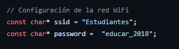

# Proyecto RFID/NFC con App Web

Es una solución eficaz para cuando se necesita restringir el acceso a un área determinada y queremos tener la lista de usuarios permitidos en una base de datos segura con una aplicación web para la interfaz grafica del control de acceso.

## Participantes

- Fernandez Joaquín - Programación
- Lescano Cristian - Fabricación de PCB
- Lacuadra Catalina - Montaje y diseño
- Macre Geremias -  Montaje y diseño

## Aplicación

Para implementarlo como control de acceso a un área, necesitamos ajustar unos parámetros del microcontrolador, para que se pueda conectar a la red wifi

[https://github.com/Tintun1/ProyectoRFID/blob/main/Codigo ESP32/nfcReader/nfcReader.ino](https://github.com/Tintun1/ProyectoRFID/blob/main/Codigo%20ESP32/nfcReader/nfcReader.ino)

una vez configurado, el microcontrolador ya tendrá acceso a la red wifi.

Para poder vincular nuestra base de datos lo debemos hacer desde este archivo:

[https://github.com/Tintun1/ProyectoRFID/blob/main/AppWeb/con_db.php](https://github.com/Tintun1/ProyectoRFID/blob/main/AppWeb/con_db.php)

se debería de poner las credenciales correspondientes a la base de datos y en [https://github.com/Tintun1/ProyectoRFID/blob/main/AppWeb/ESP32/esp32_update.php](https://github.com/Tintun1/ProyectoRFID/blob/main/AppWeb/ESP32/esp32_update.php)

tendremos la API de la conexión de la base de datos con el microcontrolador que se puede modificar a gusto.

Para poder hacer funcionar  la aplicación web necesitaremos hostear nuestro servidor, una de las formas es usar XAMMP que nos facilita el host de la pagina de manera local

## Usos

Luego de configurar y ajustar los parámetros a nuestra comodidad, dispondremos de un control de acceso funcional. Lo único que hay que hacer para probar que funcione correctamente es verificar si el host de la pagina anda correctamente, registrando nuestros datos en la pagina para acceder a nuestro panel admin y poder registrar tarjetas nuevas a la base de datos, una vez registrada probar si el control de acceso lee nuestra tarjeta y que de la autorización.

## Esquemático

